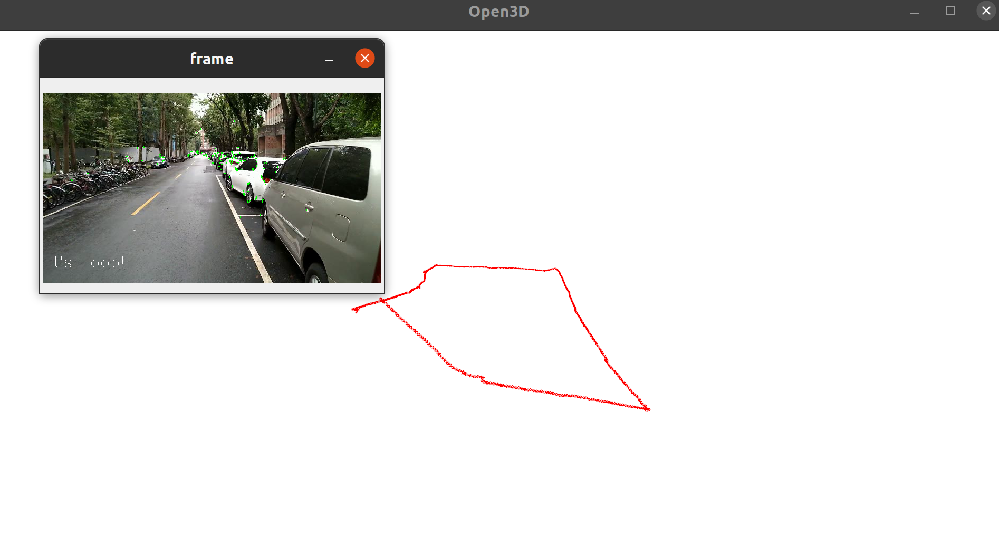

# 3DCV HW3 Visual Odometry
## camera calibration & output intrinsic parameter
```python
python camera_calibration.py calib_video.avi --output camera_parameters.npy
```
## run visual odometry on images in frames/
```python
python vo.py frames/ --camera_parameters camera_parameters.npy
```

## loop detection demo video
- Please refer to `loop_detection_demo_compress.mp4`

